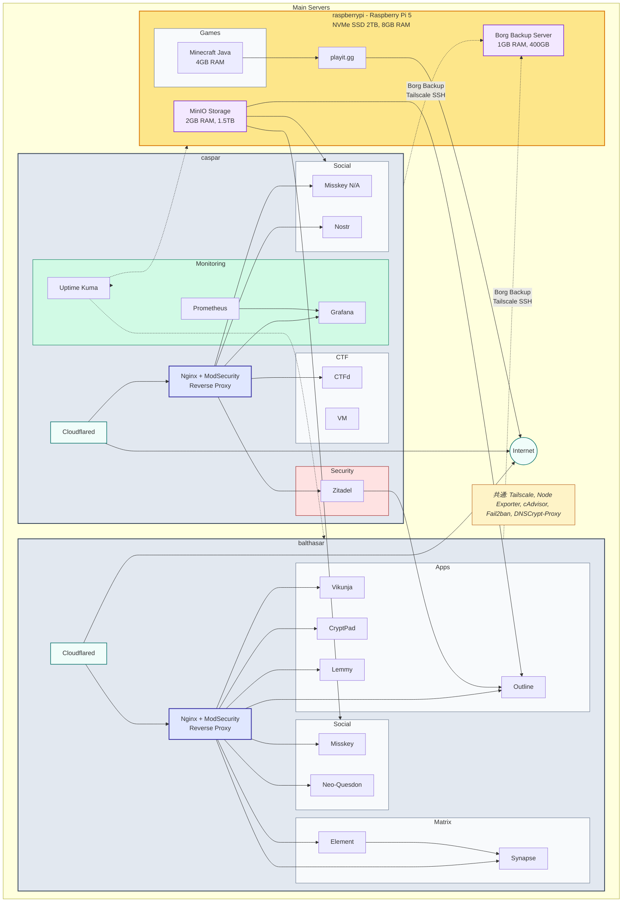
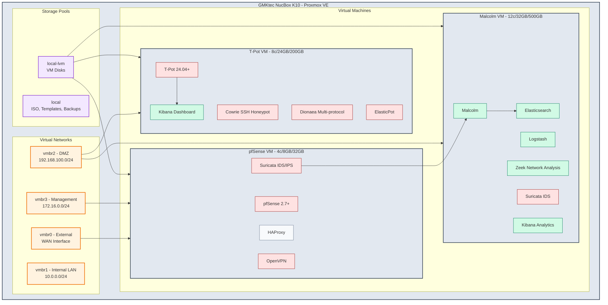
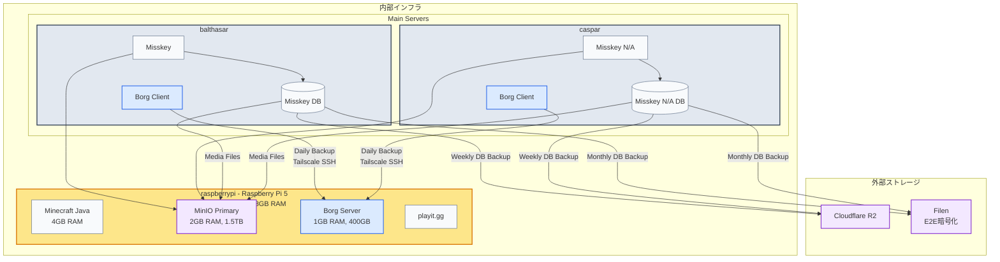
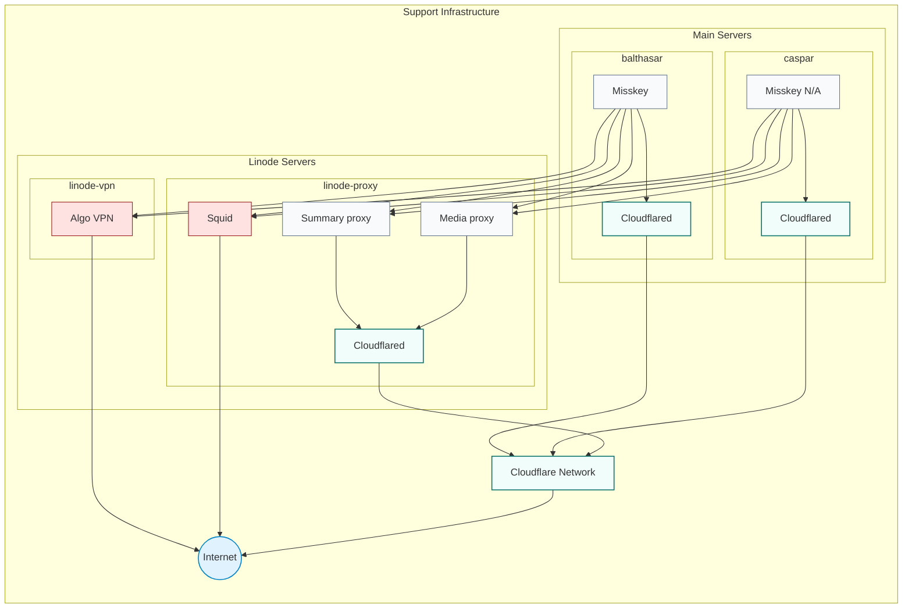

# hosted-list

```mermaid
graph TB
%% Style definitions
classDef homeServer fill:#e2e8f0,stroke:#334155,stroke-width:2px
classDef service fill:#f8fafc,stroke:#64748b,stroke-width:1px
classDef monitoring fill:#d1fae5,stroke:#047857,stroke-width:1px
classDef security fill:#fee2e2,stroke:#991b1b,stroke-width:1px
classDef common fill:#fef3c7,stroke:#b45309,stroke-width:1px,font-style:italic
classDef cloudflare fill:#f0fdfa,stroke:#0f766e,stroke-width:1.5px
classDef rpi fill:#fde68a,stroke:#d97706,stroke-width:2px
classDef proxy fill:#e0e7ff,stroke:#3730a3,stroke-width:2px
classDef storage fill:#f3e8ff,stroke:#7e22ce,stroke-width:1.5px

%% Main Infrastructure
subgraph main_servers[Main Servers]
    direction LR
    
    %% Common services
    common["共通: Tailscale, Node Exporter, cAdvisor, Fail2ban, DNSCrypt-Proxy"]:::common
    
    subgraph balthasar[balthasar]
        direction TB
        cloudflared_b[Cloudflared]:::cloudflare
        nginx_b[Nginx + ModSecurity<br/>Reverse Proxy]:::proxy
        
        subgraph social[Social]
            yamisskey[Misskey]
            neoquesdon[Neo-Quesdon]
        end
        
        subgraph matrix[Matrix]
            synapse[Synapse]
            element[Element]
        end
        
        subgraph apps[Apps]
            lemmy[Lemmy]
            outline[Outline]
            vikunja[Vikunja]
            cryptpad[CryptPad]
        end
    end
    
    subgraph caspar[caspar]
        direction TB
        cloudflared_c[Cloudflared]:::cloudflare
        nginx_c[Nginx + ModSecurity<br/>Reverse Proxy]:::proxy
        
        subgraph security[Security]
            zitadel[Zitadel]
        end
        
        subgraph monitoring[Monitoring]
            grafana[Grafana]
            prometheus[Prometheus]
            uptime[Uptime Kuma]
        end
        
        subgraph CTF[CTF]
            ctfd[CTFd]
            vm[VM]
        end
        
        subgraph social_c[Social]
            nayamisskey[Misskey N/A]
            nostream[Nostr]
        end
    end
    
    subgraph raspberrypi[raspberrypi - Raspberry Pi 5<br/>NVMe SSD 2TB, 8GB RAM]
        direction TB
        playig[playit.gg]
        minio[MinIO Storage<br/>2GB RAM, 1.5TB]:::storage
        borg_backup[Borg Backup Server<br/>1GB RAM, 400GB]:::storage
        
        subgraph games[Games]
            minecraft[Minecraft Java<br/>4GB RAM]
        end
    end
    
    %% External entity
    internet((Internet)):::cloudflare
end

%% Core connections between main servers
zitadel --> outline
minio --> social & outline & social_c
element --> synapse
minecraft --> playig
prometheus --> grafana
uptime -.-> balthasar
uptime -.-> caspar
uptime -.-> raspberrypi

%% Cloudflared to Nginx connections
cloudflared_b --> nginx_b
cloudflared_c --> nginx_c

%% Nginx reverse proxy connections to services
nginx_b --> yamisskey
nginx_b --> neoquesdon
nginx_b --> element
nginx_b --> synapse
nginx_b --> outline
nginx_b --> vikunja
nginx_b --> cryptpad
nginx_b --> lemmy

nginx_c --> nayamisskey
nginx_c --> nostream
nginx_c --> grafana
nginx_c --> ctfd
nginx_c --> zitadel

%% External connections
playig --> internet
cloudflared_b --> internet
cloudflared_c --> internet

%% Backup connections
balthasar -.->|"Borg Backup<br/>Tailscale SSH"| borg_backup
caspar -.->|"Borg Backup<br/>Tailscale SSH"| borg_backup

%% Apply styles
class balthasar,caspar homeServer
class raspberrypi rpi
class security,social,social_c,matrix,apps,games,CTF service
class monitoring monitoring
class security security
class cloudflared_b,cloudflared_c cloudflare
class nginx_b,nginx_c proxy
class minio,borg_backup storage
```

```mermaid
graph TB
%% Style definitions
classDef homeServer fill:#e2e8f0,stroke:#334155,stroke-width:2px
classDef service fill:#f8fafc,stroke:#64748b,stroke-width:1px
classDef monitoring fill:#d1fae5,stroke:#047857,stroke-width:1px
classDef security fill:#fee2e2,stroke:#991b1b,stroke-width:1px
classDef storage fill:#f3e8ff,stroke:#7e22ce,stroke-width:1.5px
classDef network fill:#fff3e0,stroke:#ef6c00,stroke-width:2px

%% Proxmox Host
subgraph proxmox["GMKtec NucBox K10 - Proxmox VE<br/>Core i9-13900HK, 64GB DDR5, 1TB NVMe"]
   %% Storage Configuration
   subgraph storage["Storage Pools"]
       local["local<br/>ISO, Templates, Backups"]:::storage
       local_lvm["local-lvm<br/>VM Disks"]:::storage
   end
   
   %% Network Bridges
   subgraph networks["Virtual Networks"]
       vmbr0["vmbr0 - External<br/>WAN Interface"]:::network
       vmbr1["vmbr1 - Internal LAN<br/>10.0.0.0/24"]:::network
       vmbr2["vmbr2 - DMZ<br/>192.168.100.0/24"]:::network
       vmbr3["vmbr3 - Management<br/>172.16.0.0/24"]:::network
   end
   
   %% Virtual Machines
   subgraph vms["Virtual Machines"]
       subgraph pfsense_vm["pfSense VM - 4c/8GB/32GB"]
           pfsense["pfSense 2.7+"]:::security
           suricata["Suricata IDS/IPS"]:::security
           haproxy["HAProxy"]:::service
           openvpn["OpenVPN"]:::security
       end
       
       subgraph tpot_vm["T-Pot VM - 8c/24GB/200GB"]
           tpot["T-Pot 24.04+"]:::security
           cowrie["Cowrie SSH Honeypot"]:::security
           dionaea["Dionaea Multi-protocol"]:::security
           elasticpot["ElasticPot"]:::security
           kibana_tpot["Kibana Dashboard"]:::monitoring
       end
       
       subgraph malcolm_vm["Malcolm VM - 12c/32GB/500GB"]
           malcolm["Malcolm"]:::monitoring
           elasticsearch["Elasticsearch"]:::monitoring
           logstash["Logstash"]:::monitoring
           zeek["Zeek Network Analysis"]:::monitoring
           suricata_malcolm["Suricata IDS"]:::security
           kibana_malcolm["Kibana Analytics"]:::monitoring
       end
   end
end

%% Network connections
vmbr0 --> pfsense_vm
vmbr2 --> tpot_vm
vmbr2 --> malcolm_vm
vmbr3 --> pfsense_vm

%% Storage connections
local_lvm --> pfsense_vm
local_lvm --> tpot_vm
local_lvm --> malcolm_vm

%% Service connections
tpot --> kibana_tpot
malcolm --> elasticsearch
suricata --> malcolm

%% Apply styles
class proxmox homeServer
class pfsense_vm,tpot_vm,malcolm_vm homeServer
```

```mermaid
graph TB
%% Style definitions
classDef homeServer fill:#e2e8f0,stroke:#334155,stroke-width:2px
classDef service fill:#f8fafc,stroke:#64748b,stroke-width:1px
classDef backup fill:#dbeafe,stroke:#2563eb,stroke-width:1.5px
classDef storage fill:#f3e8ff,stroke:#7e22ce,stroke-width:1.5px
classDef rpi fill:#fde68a,stroke:#d97706,stroke-width:2px

%% External storage services
subgraph external[外部ストレージ]
   direction LR
   r2[Cloudflare R2]:::storage
   filen[Filen\nE2E暗号化]:::storage
end

%% Support Infrastructure 
subgraph internal[内部インフラ]
   direction TB
   
   %% Raspberry Pi with MinIO and Backup
   subgraph raspi[raspberrypi - Raspberry Pi 5<br/>NVMe SSD 2TB, 8GB RAM]
       direction TB
       minecraft[Minecraft Java<br/>4GB RAM]:::service
       minio_main[MinIO Primary<br/>2GB RAM, 1.5TB]:::storage
       borg_server[Borg Server<br/>1GB RAM, 400GB]:::backup
       playig[playit.gg]:::service
   end
   
   %% Main servers with backup clients
   subgraph main_servers[Main Servers]
       direction LR
       
       subgraph balthasar[balthasar]
           direction TB
           yamisskey[Misskey]:::service
           yamisskey_db[(Misskey DB)]:::service
           borg_client_b[Borg Client]:::backup
       end
       
       subgraph caspar[caspar]
           direction TB
           nayamisskey[Misskey N/A]:::service
           nayamisskey_db[(Misskey N/A DB)]:::service
           borg_client_c[Borg Client]:::backup
       end
   end
end

%% Internal service connections
yamisskey --> yamisskey_db
yamisskey --> minio_main
nayamisskey --> nayamisskey_db
nayamisskey --> minio_main

%% DB backup connections to external storage
yamisskey_db -- "Weekly DB Backup" --> r2
yamisskey_db -- "Monthly DB Backup" --> filen
nayamisskey_db -- "Weekly DB Backup" --> r2
nayamisskey_db -- "Monthly DB Backup" --> filen

%% Borg backup connections (All to raspberrypi)
borg_client_b -- "Daily Backup<br/>Tailscale SSH" --> borg_server
borg_client_c -- "Daily Backup<br/>Tailscale SSH" --> borg_server

%% MinIO connections
yamisskey_db -- "Media Files" --> minio_main
nayamisskey_db -- "Media Files" --> minio_main

%% Apply styles
class balthasar,caspar homeServer
class raspi rpi
class yamisskey,nayamisskey,yamisskey_db,nayamisskey_db,minecraft,playig service
class borg_client_b,borg_client_c,borg_server backup
class r2,filen,minio_main storage
```

```mermaid
graph TB
%% Style definitions
classDef homeServer fill:#e2e8f0,stroke:#334155,stroke-width:2px
classDef service fill:#f8fafc,stroke:#64748b,stroke-width:1px
classDef security fill:#fee2e2,stroke:#991b1b,stroke-width:1px
classDef cloudflare fill:#f0fdfa,stroke:#0f766e,stroke-width:1.5px
classDef internet fill:#e0f2fe,stroke:#0284c7,stroke-width:1.5px

%% Support Infrastructure with connections to main servers
subgraph support[Support Infrastructure]
    direction TB
    
    subgraph linode[Linode Servers]
        direction TB
        
        subgraph vpn[linode-vpn]
            algo[Algo VPN]:::security
        end
        
        subgraph proxy[linode-proxy]
            summaryproxy[Summary proxy]:::service
            mediaproxy[Media proxy]:::service
            squid[Squid]:::security
            cloudflared_proxy[Cloudflared]:::cloudflare
        end
    end
    
    %% Main server references with their social services
    subgraph main_servers[Main Servers]
        direction LR
        
        subgraph balthasar[balthasar]
            yamisskey[Misskey]:::service
            cloudflared_b[Cloudflared]:::cloudflare
        end
        
        subgraph caspar[caspar]
            nayamisskey[Misskey N/A]:::service
            cloudflared_c[Cloudflared]:::cloudflare
        end
    end
    
    %% External networks
    cloudflare_network[Cloudflare Network]:::cloudflare
    internet((Internet)):::internet
end

%% Connections to proxies
yamisskey --> summaryproxy & mediaproxy
nayamisskey --> summaryproxy & mediaproxy

%% Direct connections from Misskey to Cloudflared
yamisskey --> cloudflared_b
nayamisskey --> cloudflared_c

%% Misskey connections to VPN and proxy
yamisskey --> algo & squid
nayamisskey --> algo & squid

%% Direct VPN and proxy connections to internet
algo --> internet
squid --> internet

%% Cloudflare connections
cloudflared_b & cloudflared_c --> cloudflare_network
cloudflared_proxy --> cloudflare_network
cloudflare_network --> internet

%% Proxy service connections to Cloudflared
summaryproxy & mediaproxy --> cloudflared_proxy
```
