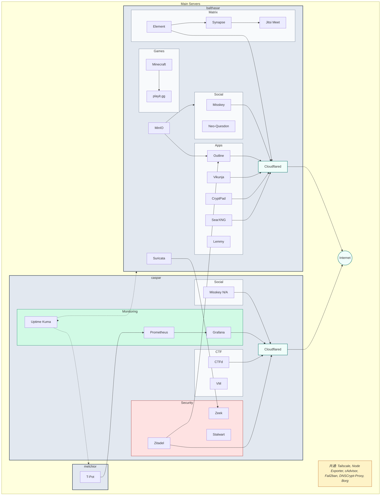
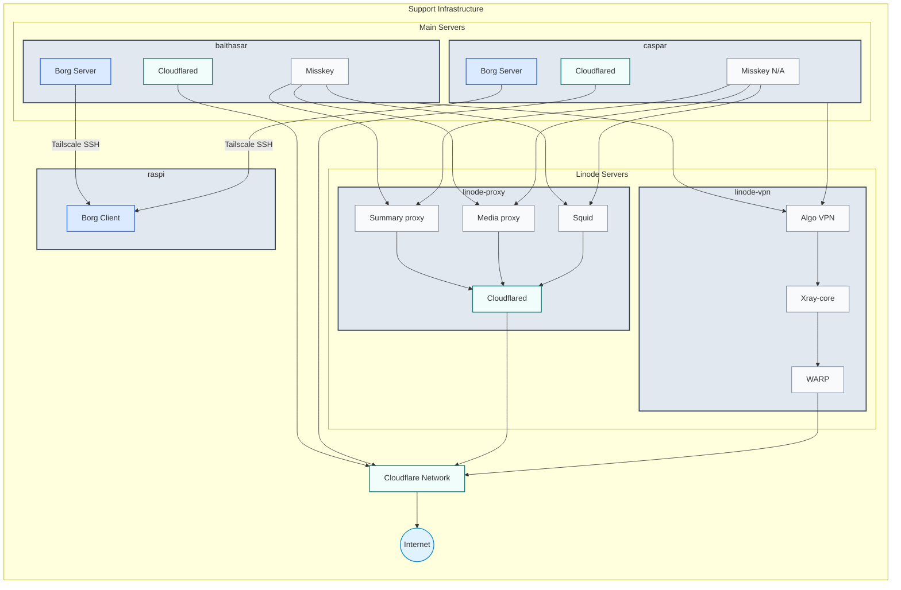

# hosted-list

```mermaid
graph TB
%% Style definitions
classDef homeServer fill:#e2e8f0,stroke:#334155,stroke-width:2px
classDef service fill:#f8fafc,stroke:#64748b,stroke-width:1px
classDef monitoring fill:#d1fae5,stroke:#047857,stroke-width:1px
classDef security fill:#fee2e2,stroke:#991b1b,stroke-width:1px
classDef common fill:#fef3c7,stroke:#b45309,stroke-width:1px,font-style:italic
classDef cloudflare fill:#f0fdfa,stroke:#0f766e,stroke-width:1.5px

%% Main Infrastructure
subgraph main_servers[Main Servers]
    direction LR
    
    %% Common services updated to include DNSCrypt
    common["共通: Tailscale, Node Exporter, cAdvisor, Fail2ban, DNSCrypt-Proxy, Borg"]:::common
    
    subgraph balthasar[balthasar]
        direction TB
        minio[MinIO]
        suricata[Suricata]
        cloudflared_b[Cloudflared]:::cloudflare
        
        subgraph social[Social]
            yamisskey[Misskey]
            neoquesdon[Neo-Quesdon]
        end
        
        subgraph matrix[Matrix]
            synapse[Synapse]
            element[Element]
            jitsi[Jitsi Meet]
        end
        
        subgraph apps[Apps]
            lemmy[Lemmy]
            outline[Outline]
            vikunja[Vikunja]
            cryptpad[CryptPad]
            searxng[SearXNG]
        end
        
        subgraph games[Games]
            minecraft[Minecraft]
            playig[playit.gg]
        end
    end
    
    subgraph caspar[caspar]
        direction TB
        cloudflared_c[Cloudflared]:::cloudflare
        
        subgraph security[Security]
            zitadel[Zitadel]
            stalwart[Stalwart]
            zeek[Zeek]
        end
        
        subgraph monitoring[Monitoring]
            grafana[Grafana]
            prometheus[Prometheus]
            uptime[Uptime Kuma]
        end
        
        subgraph CTF[CTF]
            ctfd[CTFd]
            vm[VM]
        end
        
        subgraph social_c[Social]
            nayamisskey[Misskey N/A]
        end
    end
    
    %% Added melchior to main servers
    subgraph melchior[melchior]
        tpot[T-Pot]
    end
    
    %% External entity
    internet((Internet)):::cloudflare
end

%% Core connections between main servers
suricata --> zeek
zitadel --> outline
minio --> social & outline
element --> synapse --> jitsi
minecraft --> playig
prometheus --> grafana
tpot --> prometheus
uptime -.-> balthasar
uptime -.-> caspar
uptime -.-> melchior

%% Cloudflared connections for external access
cloudflared_b --> internet
cloudflared_c --> internet
yamisskey & element & outline & vikunja & cryptpad & searxng --> cloudflared_b
nayamisskey & grafana & ctfd & zitadel --> cloudflared_c

%% Apply styles
class balthasar,caspar,melchior homeServer
class security,social,social_c,matrix,apps,games,CTF service
class monitoring monitoring
class security security
class cloudflared_b,cloudflared_c cloudflare
```

```mermaid
graph TB
%% Style definitions
classDef homeServer fill:#e2e8f0,stroke:#334155,stroke-width:2px
classDef service fill:#f8fafc,stroke:#64748b,stroke-width:1px
classDef monitoring fill:#d1fae5,stroke:#047857,stroke-width:1px
classDef security fill:#fee2e2,stroke:#991b1b,stroke-width:1px
classDef common fill:#fef3c7,stroke:#b45309,stroke-width:1px,font-style:italic
classDef cloudflare fill:#f0fdfa,stroke:#0f766e,stroke-width:1.5px
classDef internet fill:#e0f2fe,stroke:#0284c7,stroke-width:1.5px
classDef backup fill:#dbeafe,stroke:#2563eb,stroke-width:1.5px

%% Support Infrastructure with connections to main servers
subgraph support[Support Infrastructure]
    direction TB
    
    subgraph linode[Linode Servers]
        direction TB
        
        subgraph vpn[linode-vpn]
            algo[Algo VPN]:::security
            xray[Xray-core]:::security
            warp[WARP]:::security
        end
        
        subgraph proxy[linode-proxy]
            summaryproxy[Summary proxy]:::service
            mediaproxy[Media proxy]:::service
            squid[Squid]:::security
            cloudflared_proxy[Cloudflared]:::cloudflare
        end
    end
    
    %% Borg backup server with improved details
    subgraph raspi[raspi]
        borg_client[Borg Client]:::backup
    end
    
    %% Main server references with their social services
    subgraph main_servers[Main Servers]
        direction LR
        
        subgraph balthasar[balthasar]
            yamisskey[Misskey]:::service
            cloudflared_b[Cloudflared]:::cloudflare
            borg_b[Borg Server]:::backup
        end
        
        subgraph caspar[caspar]
            nayamisskey[Misskey N/A]:::service
            cloudflared_c[Cloudflared]:::cloudflare
            borg_c[Borg Server]:::backup
        end
    end
    
    %% External networks
    cloudflare_network[Cloudflare Network]:::cloudflare
    internet((Internet)):::internet
end

%% Connections to proxies
yamisskey --> summaryproxy & mediaproxy
yamisskey --> squid
nayamisskey --> summaryproxy & mediaproxy
nayamisskey --> squid

%% VPN traffic flow
balthasar & caspar --> algo --> xray --> warp

%% Backup connections - improved with SSH details
borg_b -- "Tailscale SSH" --> borg_client
borg_c -- "Tailscale SSH" --> borg_client

%% Cloudflare connections
cloudflared_b & cloudflared_c --> cloudflare_network
cloudflared_proxy --> cloudflare_network
cloudflare_network --> internet

%% Proxy service connections to Cloudflared
summaryproxy & mediaproxy & squid --> cloudflared_proxy

%% WARP goes through Cloudflare Network
warp --> cloudflare_network

%% Apply styles
class balthasar,caspar,vpn,proxy,raspi homeServer
class yamisskey,nayamisskey,algo,xray,warp,summaryproxy,mediaproxy,squid service
class cloudflared_b,cloudflared_c,cloudflared_proxy,cloudflare_network cloudflare
class borg_client,borg_b,borg_c backup
```
