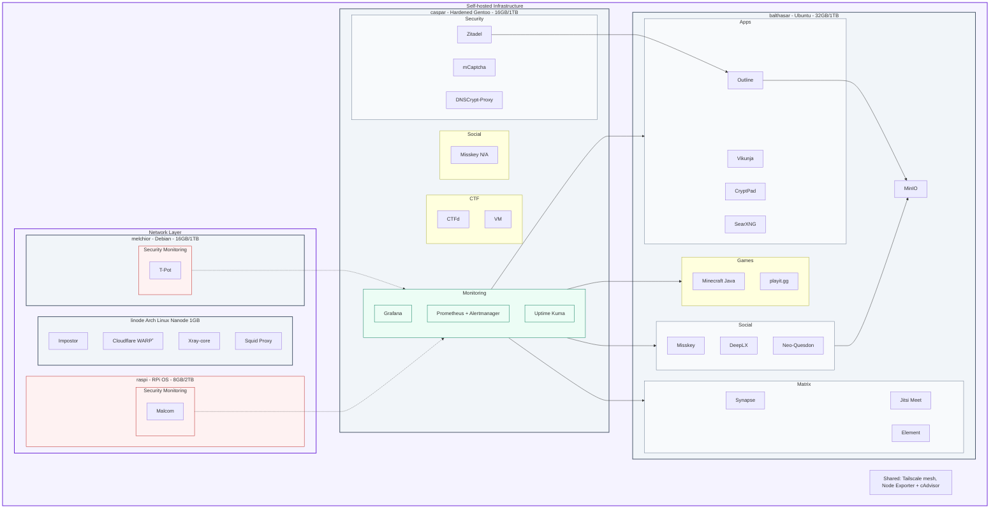

# hosted-list

```mermaid
graph TB

%% Style definitions
classDef homeServer fill:#f1f5f9,stroke:#475569,stroke-width:2px
classDef service fill:#f8fafc,stroke:#64748b,stroke-width:1px
classDef monitoring fill:#ecfdf5,stroke:#047857,stroke-width:1px
classDef security fill:#fef2f2,stroke:#b91c1c,stroke-width:1px
classDef network fill:#f5f3ff,stroke:#6d28d9,stroke-width:2px

subgraph tailscale[Self-hosted Infrastructure]
    subgraph caspar[caspar - Hardened Gentoo - 16GB/1TB]
        subgraph security[Security]
            zitadel[Zitadel]
            mcaptcha[mCaptcha]
            dnscrypt-proxy[DNSCrypt-Proxy]
        end
        subgraph monitoring[Monitoring]
            grafana[Grafana]
            prometheus[Prometheus + Alertmanager]
            uptime[Uptime Kuma]
        end
        subgraph CTF[CTF]
            ctfd[CTFd]
            browser-vm[VM]
        end
        subgraph social_caspar[Social]
            nayamisskey[Misskey N/A]
        end
    end

    subgraph balthasar[balthasar - Ubuntu - 32GB/1TB]
        minio[MinIO]
        subgraph social[Social]
            yamisskey[Misskey]
            deeplx[DeepLX]
            neoquesdon[Neo-Quesdon]
        end
        subgraph matrix[Matrix]
            synapse[Synapse]
            element[Element]
            jitsi[Jitsi Meet]
        end
        subgraph apps[Apps]
            outline[Outline]
            vikunja[Vikunja]
            cryptpad[CryptPad]
            searxng[SearXNG]
        end
        subgraph games[Games]
            minecraft[Minecraft Java]
            playig[playit.gg]
        end
    end

    subgraph network_layer[Network Layer]
        direction TB
        subgraph linode["linode Arch Linux Nanode 1GB"]
            direction TB
            impostor[Impostor]
            warp[Cloudflare WARP⁺]
            xray[Xray-core]
            squid[Squid Proxy]
        end

        subgraph melchior[melchior - Debian - 16GB/1TB]
            subgraph nsm[Security Monitoring]
                tpot[T-Pot]
            end
        end

        subgraph raspi[raspi - RPi OS - 8GB/2TB]
            subgraph nsm2[Security Monitoring]
                malcom[Malcom]
            end
        end
    end

%% Dependencies
zitadel --> outline
nsm -.-> monitoring
nsm2 -.-> monitoring
monitoring --> social & matrix & apps & games
social --> minio
outline --> minio
matrix --> jitsi

%% Note
note["Shared: Tailscale mesh, Node Exporter + cAdvisor"]
end

%% Apply styles
class caspar,balthasar,melchior,linode homeServer
class security,social,matrix,apps service
class monitoring,prometheus,grafana,uptime monitoring
class raspi,nsm,nsm2 security
class tailscale,network_layer network
```
