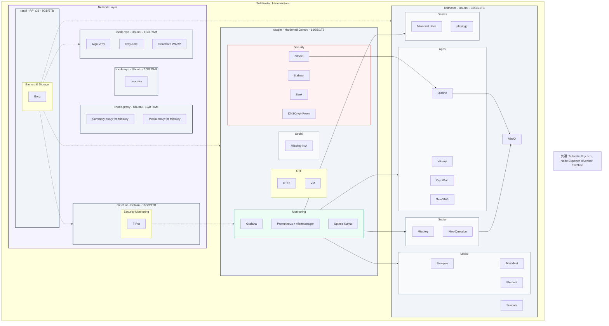

# hosted-list

```mermaid
graph TB
%% Style definitions
classDef homeServer fill:#f1f5f9,stroke:#475569,stroke-width:2px
classDef service fill:#f8fafc,stroke:#64748b,stroke-width:1px
classDef monitoring fill:#ecfdf5,stroke:#047857,stroke-width:1px
classDef security fill:#fef2f2,stroke:#b91c1c,stroke-width:1px
classDef network fill:#f5f3ff,stroke:#6d28d9,stroke-width:2px
subgraph tailscale[Self-hosted Infrastructure]
    subgraph network_layer[Network Layer]
        subgraph linode_vpn["linode-vpn - Ubuntu - 1GB RAM"]
            algo[Algo VPN]
            xray[Xray-core]
            warp[Cloudflare WARP]
        end
        subgraph linode_proxy["linode-proxy - Ubuntu - 1GB RAM"]
            summaryproxy[Summary proxy for Misskey]
            mediaproxy[Media proxy for Misskey]
        end
        subgraph linode_app["linode-app - Ubuntu - 1GB RAM"]
            impostor[Impostor]
        end
        subgraph raspi[raspi - RPi OS - 8GB/2TB]
            subgraph backup[Backup & Storage]
                borgbackup[Borg]
            end
        end
        
        subgraph melchior[melchior - Debian - 16GB/1TB]
            subgraph nsm[Security Monitoring]
                tpot[T-Pot]
            end
        end
    end
    
    subgraph caspar[caspar - Hardened Gentoo - 16GB/1TB]
        subgraph security[Security]
            zitadel[Zitadel]
            stalwart[Stalwart]
            zeek[Zeek]
            dnscrypt-proxy[DNSCrypt-Proxy]
        end
        subgraph monitoring[Monitoring]
            grafana[Grafana]
            prometheus[Prometheus + Alertmanager]
            uptime[Uptime Kuma]
        end
        subgraph CTF[CTF]
            ctfd[CTFd]
            browser-vm[VM]
        end
        subgraph social_caspar[Social]
            nayamisskey[Misskey N/A]
        end
    end
    
    subgraph balthasar[balthasar - Ubuntu - 32GB/1TB]
        suricata[Suricata]
        minio[MinIO]
        subgraph social[Social]
            yamisskey[Misskey]
            neoquesdon[Neo-Quesdon]
        end
        subgraph matrix[Matrix]
            synapse[Synapse]
            element[Element]
            jitsi[Jitsi Meet]
        end
        subgraph apps[Apps]
            outline[Outline]
            vikunja[Vikunja]
            cryptpad[CryptPad]
            searxng[SearXNG]
        end
        subgraph games[Games]
            minecraft[Minecraft Java]
            playig[playit.gg]
        end
    end
end

%% Dependencies
zitadel --> outline
nsm -.-> monitoring
backup -.-> balthasar & caspar & melchior & linode_vpn
monitoring --> social & matrix & apps & games
social --> minio
outline --> minio
matrix --> jitsi
%% Note
note["共通: Tailscale メッシュ, Node Exporter, cAdvisor, Fail2ban"]

%% Apply styles
class caspar,balthasar,melchior,linode_vpn,linode_proxy,linode_app,raspi homeServer
class security,social,social_caspar,matrix,apps,games service
class monitoring monitoring
class security security
class network_layer network
```
