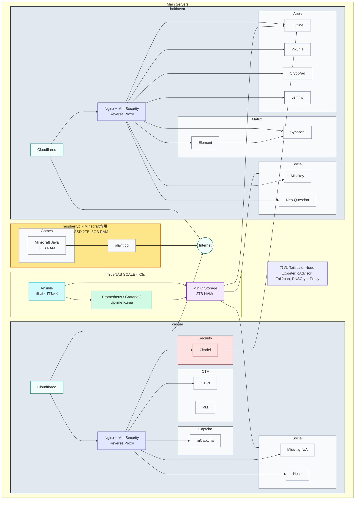
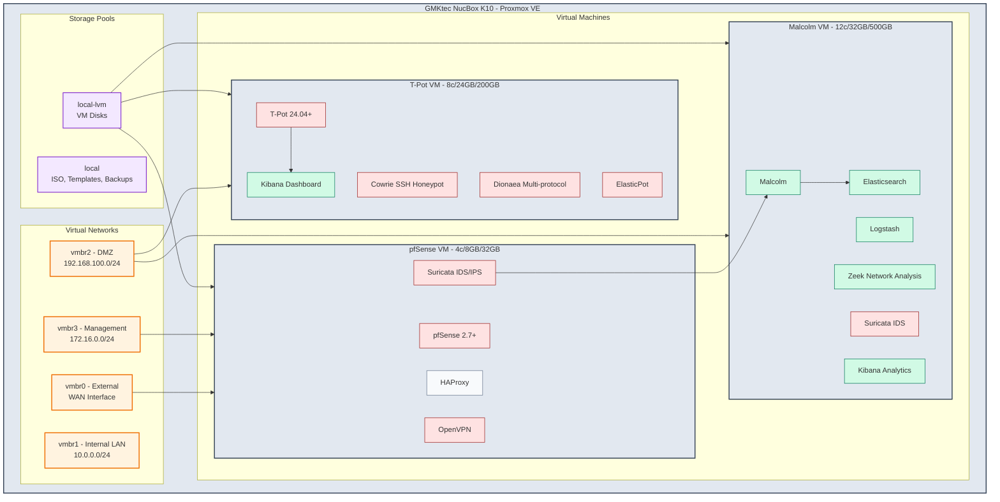
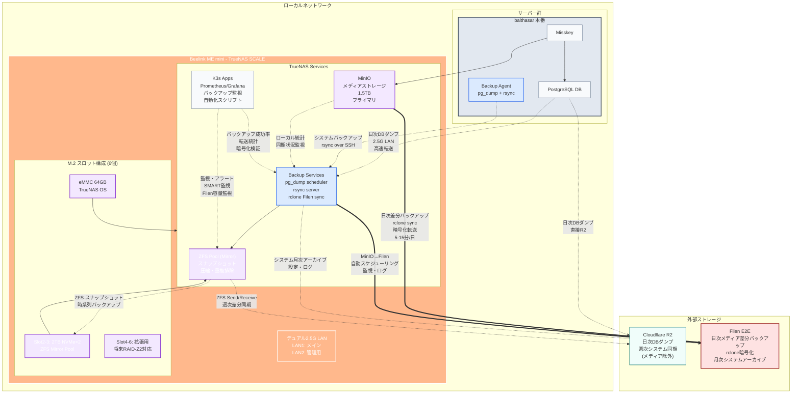
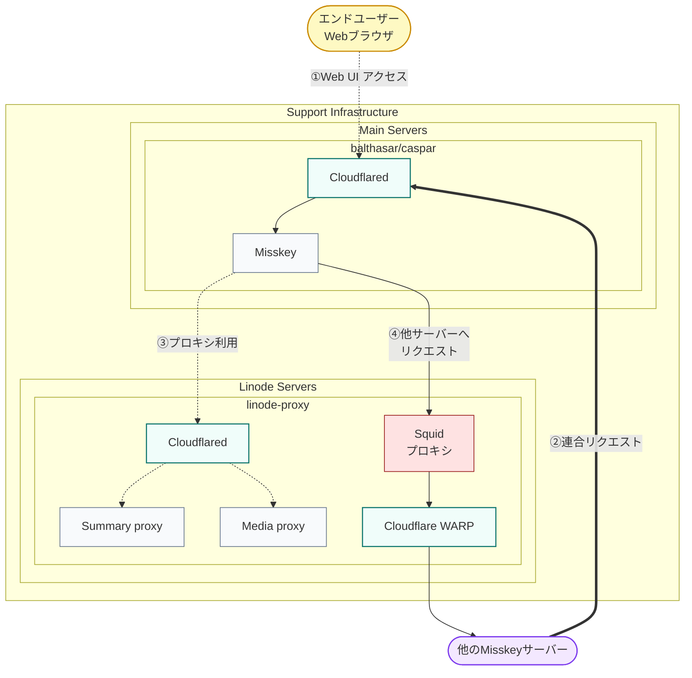

# hosted-list

## Main Infrastructure Overview



## Proxmox Virtualization Platform & Security Environment



## Storage & Backup Strategy


```
```

## Network Traffic Flow & Proxy Configuration


