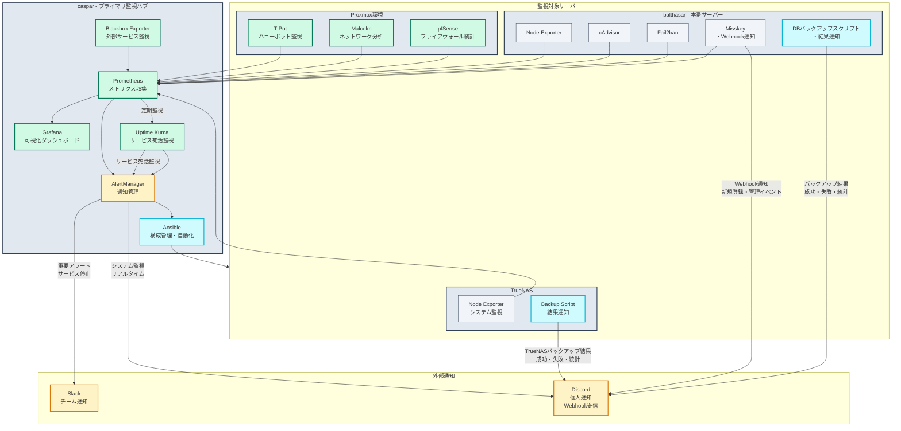

# hosted-list

## Service Architecture & Deployment Overview

## Proxmox Virtualization Platform & Security Environment

## Integrated Monitoring ＆ Automation System

## Storage & Backup Strategy

## Network Traffic Flow & Proxy Configuration

