# hosted-list

## Service Architecture & Deployment Overview

## Proxmox Virtualization Platform & Security Environment

## Integrated Monitoring & Automation System with IaC

```mermaid
graph TB
    %% Style definitions
    classDef monitoring fill:#d1fae5,stroke:#047857,stroke-width:2px
    classDef automation fill:#cffafe,stroke:#06b6d4,stroke-width:2px
    classDef homeServer fill:#e2e8f0,stroke:#334155,stroke-width:2px
    classDef common fill:#f1f5f9,stroke:#475569,stroke-width:1px
    classDef alert fill:#fef3c7,stroke:#d97706,stroke-width:2px
    classDef storage fill:#f3e8ff,stroke:#7e22ce,stroke-width:1.5px
    classDef iac fill:#f0f9ff,stroke:#0369a1,stroke-width:2px
    classDef template fill:#fef3c7,stroke:#d97706,stroke-width:1.5px

    %% IaC Management Layer
    subgraph iac_layer["Infrastructure as Code Layer"]
        direction TB
        
        subgraph git_ops["GitOps Workflow"]
            git_repo["Git Repository"]:::iac
            github_actions["GitHub Actions"]:::automation
        end
        
        subgraph terraform_mgmt["Terraform Management"]
            terraform_cli["Terraform"]:::iac
            tf_state["Terraform State"]:::iac
        end
    end

    %% Caspar - Enhanced with IaC
    subgraph caspar["caspar - プライマリ監視ハブ + IaC制御"]
        direction TB
        
        subgraph monitoring_core["Core Monitoring"]
            prometheus["Prometheus<br/>メトリクス収集<br/>+ Infrastructure targets"]:::monitoring
            blackbox_exporter["Blackbox Exporter<br/>外部サービス監視<br/>+ VM health checks"]:::monitoring
            grafana["Grafana<br/>可視化ダッシュボード<br/>+ Infrastructure metrics"]:::monitoring
            uptime_kuma["Uptime Kuma<br/>サービス死活監視<br/>+ Automated discovery"]:::monitoring
            alert_manager["AlertManager<br/>通知管理<br/>+ Infrastructure alerts"]:::alert
        end
        
        subgraph automation_enhanced["Enhanced Automation"]
            ansible["Ansible<br/>構成管理・自動化<br/>+ Dynamic inventory<br/>+ Cloud-init integration"]:::automation
            terraform_runner["Terraform Runner<br/>• Infrastructure changes<br/>• VM lifecycle<br/>• Config drift detection"]:::iac
            cloud_init_mgmt["Cloud-init Manager<br/>• Template generation<br/>• Config validation<br/>• Deployment tracking"]:::template
        end
    end

    %% External Notifications - Enhanced
    subgraph notifications["外部通知 + Infrastructure Events"]
        direction TB
        slack["Slack<br/>チーム通知<br/>+ Infrastructure changes<br/>+ Deployment status"]:::alert
        discord["Discord<br/>個人通知<br/>+ VM lifecycle events<br/>+ Automation results"]:::alert
    end

    %% Monitored Infrastructure - IaC Managed
    subgraph infrastructure["IaC管理インフラストラクチャ"]
        direction TB
        
        subgraph balthasar["balthasar - 本番サーバー (IaC管理)"]
            direction TB
            node_exporter_b["Node Exporter<br/>+ Terraform managed"]:::common
            cadvisor_b["cAdvisor<br/>+ Auto-configured"]:::common
            fail2ban_b["Fail2ban<br/>+ Template deployed"]:::common
            misskey_app["Misskey<br/>+ Cloud-init deployed<br/>+ Webhook通知"]:::common
            db_backup_script["DBバックアップスクリプト<br/>+ Ansible managed<br/>+ 結果通知"]:::automation
        end
        
        subgraph proxmox_iac["Proxmox環境 (Terraform管理)"]
            direction TB
            tpot_iac["T-Pot<br/>+ Terraform provisioned<br/>+ Cloud-init configured<br/>+ ハニーポット監視"]:::monitoring
            malcolm_iac["Malcolm<br/>+ IaC deployed<br/>+ Auto-configured<br/>+ ネットワーク分析"]:::monitoring
            pfsense_iac["pfSense<br/>+ Template deployed<br/>+ Ansible configured<br/>+ ファイアウォール統計"]:::monitoring
            vm_templates["VM Templates<br/>+ Cloud-init ready<br/>+ Monitoring pre-installed<br/>+ Auto-discovery enabled"]:::template
        end
        
        subgraph truenas_iac["TrueNAS (IaC統合)"]
            direction TB
            node_exporter_t["Node Exporter<br/>+ Ansible deployed<br/>+ システム監視"]:::common
            backup_script_iac["Backup Script<br/>+ Template generated<br/>+ 結果通知<br/>+ Infrastructure backup"]:::automation
        end
    end

    %% IaC Workflow Connections
    git_repo --> github_actions
    github_actions --> terraform_cli
    github_actions --> ansible
    terraform_cli --> tf_state
    terraform_cli --> terraform_runner

    %% Infrastructure Provisioning Flow
    terraform_runner -->|"VM作成・更新<br/>Network設定<br/>Storage割り当て"| proxmox_iac
    cloud_init_mgmt -->|"初期設定<br/>サービス起動<br/>監視エージェント"| vm_templates
    ansible -->|"設定管理<br/>アプリケーション<br/>監視設定"| infrastructure

    %% Enhanced Monitoring Data Flow
    node_exporter_b --> prometheus
    cadvisor_b --> prometheus
    fail2ban_b --> prometheus
    misskey_app --> prometheus
    node_exporter_t --> prometheus
    
    tpot_iac --> prometheus
    malcolm_iac --> prometheus
    pfsense_iac --> prometheus
    vm_templates -->|"Auto-discovery<br/>Dynamic targets"| prometheus
    
    blackbox_exporter --> prometheus
    tf_state -->|"Infrastructure inventory<br/>Target discovery"| prometheus

    %% Cross-monitoring for redundancy
    uptime_kuma -->|"サービス死活監視<br/>+ Infrastructure health"| alert_manager

    %% Monitoring Integration
    prometheus --> grafana
    prometheus --> alert_manager
    uptime_kuma --> alert_manager

    %% External monitoring
    prometheus -->|"定期監視<br/>+ Infrastructure metrics"| uptime_kuma

    %% Enhanced AlertManager Notifications
    alert_manager -->|"重要アラート<br/>サービス停止<br/>+ Infrastructure failures"| slack
    alert_manager -->|"システム監視<br/>リアルタイム<br/>+ VM lifecycle events"| discord

    %% Enhanced Application Notifications
    misskey_app -->|"Webhook通知<br/>新規登録・管理イベント"| discord
    db_backup_script -->|"バックアップ結果<br/>成功・失敗・統計"| discord
    backup_script_iac -->|"TrueNASバックアップ結果<br/>+ Infrastructure backup<br/>成功・失敗・統計"| discord

    %% IaC Event Notifications
    terraform_runner -->|"Infrastructure changes<br/>VM lifecycle events<br/>Configuration drift"| discord
    github_actions -->|"Deployment status<br/>Pipeline results<br/>Validation errors"| slack

    %% Enhanced Automation Flow
    alert_manager --> ansible
    alert_manager --> terraform_runner
    ansible --> infrastructure
    terraform_runner -->|"Self-healing"| proxmox_iac

    %% Infrastructure Feedback Loop
    prometheus -->|"Metrics-driven"| terraform_runner
    grafana -->|"Capacity planning"| cloud_init_mgmt

    %% Apply styles
    class caspar homeServer
    class balthasar,proxmox_iac,truenas_iac homeServer
    class iac_layer iac
    class git_ops iac
    class terraform_mgmt iac
    class monitoring_core monitoring
    class automation_enhanced automation
```

## Storage & Backup Strategy

```mermaid
graph TB
    %% Style definitions
    classDef server fill:#e2e8f0,stroke:#334155,stroke-width:2px
    classDef service fill:#f8fafc,stroke:#64748b,stroke-width:1px
    classDef backup fill:#dbeafe,stroke:#2563eb,stroke-width:1.5px
    classDef storage fill:#f3e8ff,stroke:#7e22ce,stroke-width:1.5px
    classDef beelink fill:#ffb88c,stroke:#ffffff,stroke-width:2px,color:#ffffff
    classDef cloud fill:#f0fdfa,stroke:#0f766e,stroke-width:1.5px
    classDef zfs fill:#4c1d95,stroke:#c4b5fd,stroke-width:2px,color:#ffffff
    classDef encrypted fill:#fee2e2,stroke:#991b1b,stroke-width:2px

    %% External storage
    subgraph external["外部ストレージ"]
        r2["Cloudflare R2<br/>日次DBダンプ<br/>週次システム同期<br/>(メディア除外)"]:::cloud
        filen["Filen E2E<br/>日次メディア差分バックアップ<br/>rclone暗号化<br/>月次システムアーカイブ"]:::encrypted
    end

    %% Internal network
    subgraph internal["ローカルネットワーク"]
        
        %% Beelink TrueNAS
        subgraph beelink_nas["Beelink ME mini - TrueNAS SCALE 24.10"]
            subgraph m2_slots["M.2 スロット構成 (6個)"]
                emmc["eMMC 64GB<br/>TrueNAS OS"]:::storage
                slot23["Slot2-3: 2TB NVMe×2<br/>ZFS Mirror Pool"]:::zfs
                slot456["Slot4-6: 拡張用<br/>将来RAID-Z2対応"]:::storage
            end
            
            subgraph truenas_services["TrueNAS Services (Docker統一)"]
                zfs_pool["ZFS Pool (Mirror)<br/>スナップショット<br/>圧縮・重複排除"]:::zfs
                backup_svc["Backup Services<br/>pg_dump scheduler<br/>rsync server<br/>rclone Filen sync"]:::backup
                minio["MinIO (Docker)<br/>メディアストレージ<br/>1.5TB<br/>プライマリ"]:::storage
                node_exporter["Node Exporter (Docker)<br/>監視エージェント"]:::service
            end
            
            dual_lan["デュアル2.5G LAN<br/>LAN1: メイン<br/>LAN2: 管理用"]:::beelink
        end
        
        %% Main servers
        subgraph servers["サーバー群"]
            subgraph balthasar["balthasar 本番"]
                misskey1["Misskey"]:::service
                db1["PostgreSQL DB"]:::service
                backup1["Backup Agent<br/>pg_dump + rsync"]:::backup
            end
        end
    end

    %% Service connections - シンプルな構成維持
    misskey1 --> db1
    misskey1 --> minio

    %% MinIO → Filen 日次差分バックアップ (新規メイン)
    minio ==>|"日次差分バックアップ<br/>rclone sync<br/>暗号化転送<br/>5-15分/日"| filen
    backup_svc ==>|"MinIO→Filen<br/>自動スケジューリング<br/>監視・ログ"| filen

    %% DB Backup flows - 既存維持
    db1 -.->|"日次DBダンプ<br/>2.5G LAN<br/>高速転送"| backup_svc
    db1 -.->|"日次DBダンプ<br/>直接R2"| r2
    
    %% TrueNAS internal flows
    backup_svc --> zfs_pool
    slot23 --> zfs_pool
    emmc --> truenas_services
    
    %% ZFS snapshots and replication
    zfs_pool -.->|"ZFS Send/Receive<br/>週次差分同期"| r2
    zfs_pool -.->|"ZFS スナップショット<br/>時系列バックアップ"| slot23
    
    %% System backup flows
    backup1 -.->|"システムバックアップ<br/>rsync over SSH"| backup_svc
    minio -.->|"ローカル統計<br/>同期状況監視"| backup_svc
    
    %% Monitoring flows
    node_exporter -.->|"システム監視<br/>メトリクス送信"| zfs_pool
    backup_svc -.->|"バックアップ成功率<br/>転送統計<br/>暗号化検証"| node_exporter
    
    %% External sync flows  
    backup_svc -.->|"システム月次アーカイブ<br/>設定・ログ"| filen

    %% Apply styles
    class balthasar server
    class beelink_nas beelink
    class misskey1,db1,node_exporter service
    class backup_svc,backup1 backup
    class r2 cloud
    class filen encrypted
    class minio,slot456,slot23,zfs_pool storage
    class emmc storage
```

## Network Traffic Flow & Proxy Configuration

```mermaid
graph TB
classDef homeServer fill:#e2e8f0,stroke:#334155,stroke-width:2px
classDef service fill:#f8fafc,stroke:#64748b,stroke-width:1px
classDef security fill:#fee2e2,stroke:#991b1b,stroke-width:1px
classDef cloudflare fill:#f0fdfa,stroke:#0f766e,stroke-width:1.5px
classDef internet fill:#e0f2fe,stroke:#0284c7,stroke-width:1.5px
classDef user fill:#fef9c3,stroke:#ca8a04,stroke-width:1.5px
classDef federation fill:#f3e8ff,stroke:#7c3aed,stroke-width:1.5px
%% 強調（除外ターゲット）
classDef exclude fill:#fff1f2,stroke:#ef4444,stroke-width:2px,stroke-dasharray: 6 3,color:#ef4444
classDef excludeHome fill:#fef7f7,stroke:#dc2626,stroke-width:3px,stroke-dasharray: 8 4,color:#dc2626

%% External actors
enduser([エンドユーザー<br/>Webブラウザ]):::user
external_servers([外部サーバー<br/>（他Misskey・画像・API等）]):::federation

subgraph support[Support Infrastructure]
    direction TB
    
    subgraph linode[Linode Servers]
        direction TB
        subgraph proxy[linode-proxy]
            summaryproxy[Summary proxy]:::service
            mediaproxy[Media proxy]:::service
            squid[Squid<br/>プロキシ]:::security
            warp[Cloudflare WARP]:::cloudflare
            cloudflared_p[Cloudflared]:::cloudflare
        end
    end
    
    subgraph main_servers[Main Servers]
        direction TB
        subgraph balthasar_caspar[balthasar/caspar]
            yamisskey[Misskey]:::service
            cloudflared_bc[Cloudflared]:::cloudflare
        end
        
        subgraph truenas[🏠 TrueNAS Scale（自宅サーバー）]
            direction TB
            minio[MinIO<br/>オブジェクトストレージ]:::excludeHome
            cloudflared_home[Cloudflared<br/>（MinIO用トンネル）]:::excludeHome
        end
    end
end

%% エンドユーザーのアクセス経路（青線）
enduser -.->|"①Web UI アクセス"| cloudflared_bc

%% 他のMisskeyサーバーからの連合リクエスト（紫線）
external_servers ==>|"②連合リクエスト"| cloudflared_bc

%% CloudflaredからMisskeyへの共通経路
cloudflared_bc --> yamisskey

%% Misskeyサーバーからプロキシへの内部リクエスト（オレンジ線）
yamisskey -.->|"③プロキシ利用"| cloudflared_p
cloudflared_p -.-> summaryproxy
cloudflared_p -.-> mediaproxy

%% Misskeyサーバーからの外向き通信（赤線）
yamisskey -->|"④外部への全リクエスト<br/>（連合・画像・メディア等）<br/>※プロキシバイパス除く"| squid
squid --> warp
warp -->|"外部サーバーへ"| external_servers

%% プロキシバイパス対象への直接アクセス
yamisskey -.->|"プロキシバイパス<br/>（DeepL・reCAPTCHA等）"| external_servers

%% MinIOへのアクセス（Squid経由だがWARP除外）
yamisskey -.->|"⑤ファイルアップロード/ダウンロード<br/>drive.yami.ski"| squid
squid -.->|"WARP除外対象<br/>直接接続"| cloudflared_home
cloudflared_home -.-> minio

%% エンドユーザーからのメディアアクセス
enduser -.->|"メディアファイル<br/>アクセス"| cloudflared_home
```

