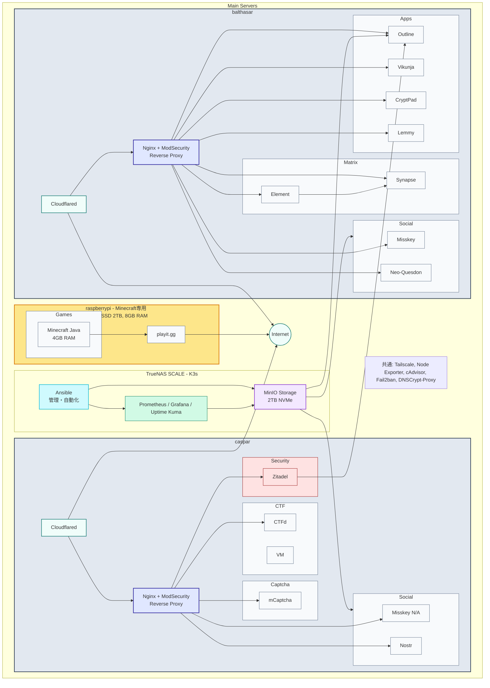
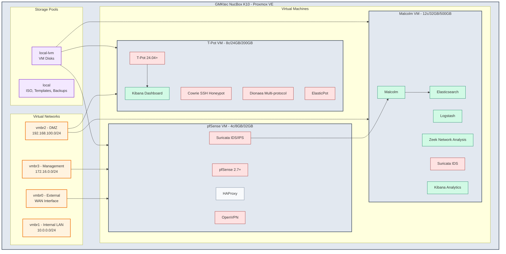
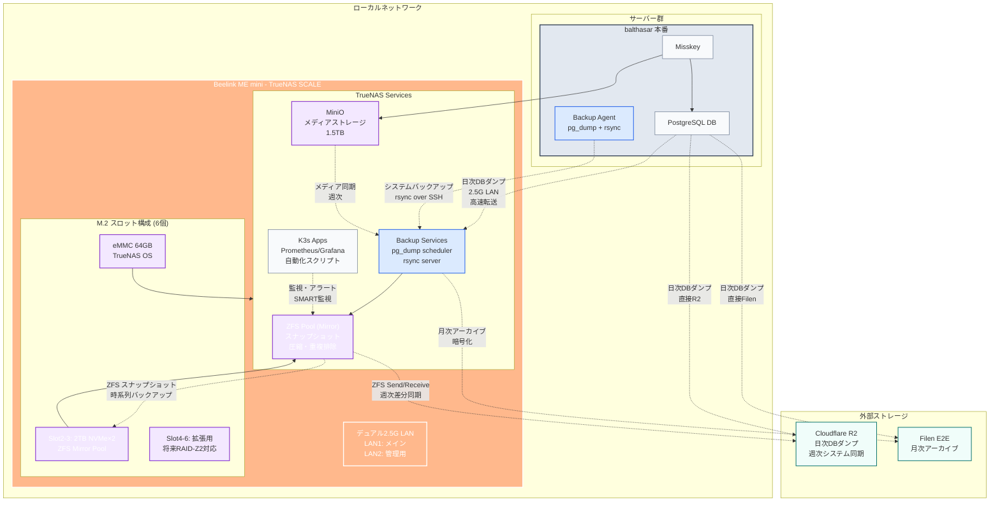
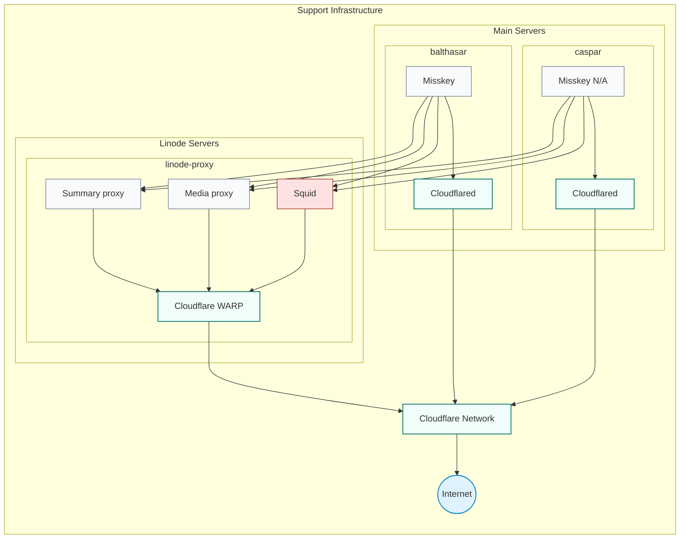

# hosted-list

```mermaid
graph TB
    %% Style definitions
    classDef homeServer fill:#e2e8f0,stroke:#334155,stroke-width:2px
    classDef service fill:#f8fafc,stroke:#64748b,stroke-width:1px
    classDef monitoring fill:#d1fae5,stroke:#047857,stroke-width:1px
    classDef storage fill:#f3e8ff,stroke:#7e22ce,stroke-width:1.5px
    classDef rpi fill:#fde68a,stroke:#d97706,stroke-width:2px
    classDef proxy fill:#e0e7ff,stroke:#3730a3,stroke-width:2px
    classDef cloudflare fill:#f0fdfa,stroke:#0f766e,stroke-width:1.5px
    classDef security fill:#fee2e2,stroke:#991b1b,stroke-width:1px
    classDef automation fill:#cffafe,stroke:#06b6d4,stroke-width:1.5px

    %% Main Infrastructure
    subgraph main_servers[Main Servers]
        direction LR
        
        common["共通: Tailscale, Node Exporter, cAdvisor, Fail2ban, DNSCrypt-Proxy"]:::common
        
        subgraph balthasar[balthasar]
            direction TB
            cloudflared_b[Cloudflared]:::cloudflare
            nginx_b[Nginx + ModSecurity<br/>Reverse Proxy]:::proxy
            
            subgraph social[Social]
                yamisskey[Misskey]:::service
                neoquesdon[Neo-Quesdon]:::service
            end
            
            subgraph matrix[Matrix]
                synapse[Synapse]:::service
                element[Element]:::service
            end
            
            subgraph apps[Apps]
                lemmy[Lemmy]:::service
                outline[Outline]:::service
                vikunja[Vikunja]:::service
                cryptpad[CryptPad]:::service
            end
        end
        
        subgraph caspar[caspar]
            direction TB
            cloudflared_c[Cloudflared]:::cloudflare
            nginx_c[Nginx + ModSecurity<br/>Reverse Proxy]:::proxy
            
            subgraph security_group[Security]
                zitadel[Zitadel]:::security
            end
            
            subgraph CTF[CTF]
                ctfd[CTFd]:::service
                vm[VM]:::service
            end
            
            subgraph social_c[Social]
                nayamisskey[Misskey N/A]:::service
                nostream[Nostr]:::service
            end

            subgraph captcha_group[Captcha]
                mcaptcha[mCaptcha]:::service
            end
        end
        
        subgraph raspberrypi[raspberrypi - Minecraft専用<br/>NVMe SSD 2TB, 8GB RAM]
            direction TB
            playig[playit.gg]:::service
            
            subgraph games[Games]
                minecraft[Minecraft Java<br/>4GB RAM]:::service
            end
        end
        
        subgraph truenas[TrueNAS SCALE - K3s]
            direction TB
            minio_truenas[MinIO Storage<br/>2TB NVMe]:::storage
            k3s_monitoring["Prometheus / Grafana / Uptime Kuma"]:::monitoring
            ansible["Ansible<br/>管理・自動化"]:::automation
        end
        
        internet((Internet)):::cloudflare
    end

    %% Core connections
    zitadel --> outline
    minio_truenas --> social & outline & social_c
    element --> synapse
    minecraft --> playig
    k3s_monitoring --> minio_truenas
    ansible --> k3s_monitoring
    ansible --> minio_truenas

    %% Cloudflared to Nginx connections
    cloudflared_b --> nginx_b
    cloudflared_c --> nginx_c

    %% Nginx to services
    nginx_b --> yamisskey
    nginx_b --> neoquesdon
    nginx_b --> element
    nginx_b --> synapse
    nginx_b --> outline
    nginx_b --> vikunja
    nginx_b --> cryptpad
    nginx_b --> lemmy
    nginx_c --> nayamisskey
    nginx_c --> nostream
    nginx_c --> ctfd
    nginx_c --> zitadel
    nginx_c --> mcaptcha

    %% External connections
    playig --> internet
    cloudflared_b --> internet
    cloudflared_c --> internet

    %% Apply styles
    class balthasar,caspar homeServer
    class raspberrypi rpi
    class social,social_c,matrix,apps,games,CTF,captcha_group service
    class k3s_monitoring monitoring
    class security_group security
    class cloudflared_b,cloudflared_c cloudflare
    class nginx_b,nginx_c proxy
    class minio_truenas storage
    class ansible automation
```

```mermaid
graph TB
%% Style definitions
classDef homeServer fill:#e2e8f0,stroke:#334155,stroke-width:2px
classDef service fill:#f8fafc,stroke:#64748b,stroke-width:1px
classDef monitoring fill:#d1fae5,stroke:#047857,stroke-width:1px
classDef security fill:#fee2e2,stroke:#991b1b,stroke-width:1px
classDef storage fill:#f3e8ff,stroke:#7e22ce,stroke-width:1.5px
classDef network fill:#fff3e0,stroke:#ef6c00,stroke-width:2px

%% Proxmox Host
subgraph proxmox["GMKtec NucBox K10 - Proxmox VE<br/>Core i9-13900HK, 64GB DDR5, 1TB NVMe"]
   %% Storage Configuration
   subgraph storage["Storage Pools"]
       local["local<br/>ISO, Templates, Backups"]:::storage
       local_lvm["local-lvm<br/>VM Disks"]:::storage
   end
   
   %% Network Bridges
   subgraph networks["Virtual Networks"]
       vmbr0["vmbr0 - External<br/>WAN Interface"]:::network
       vmbr1["vmbr1 - Internal LAN<br/>10.0.0.0/24"]:::network
       vmbr2["vmbr2 - DMZ<br/>192.168.100.0/24"]:::network
       vmbr3["vmbr3 - Management<br/>172.16.0.0/24"]:::network
   end
   
   %% Virtual Machines
   subgraph vms["Virtual Machines"]
       subgraph pfsense_vm["pfSense VM - 4c/8GB/32GB"]
           pfsense["pfSense 2.7+"]:::security
           suricata["Suricata IDS/IPS"]:::security
           haproxy["HAProxy"]:::service
           openvpn["OpenVPN"]:::security
       end
       
       subgraph tpot_vm["T-Pot VM - 8c/24GB/200GB"]
           tpot["T-Pot 24.04+"]:::security
           cowrie["Cowrie SSH Honeypot"]:::security
           dionaea["Dionaea Multi-protocol"]:::security
           elasticpot["ElasticPot"]:::security
           kibana_tpot["Kibana Dashboard"]:::monitoring
       end
       
       subgraph malcolm_vm["Malcolm VM - 12c/32GB/500GB"]
           malcolm["Malcolm"]:::monitoring
           elasticsearch["Elasticsearch"]:::monitoring
           logstash["Logstash"]:::monitoring
           zeek["Zeek Network Analysis"]:::monitoring
           suricata_malcolm["Suricata IDS"]:::security
           kibana_malcolm["Kibana Analytics"]:::monitoring
       end
   end
end

%% Network connections
vmbr0 --> pfsense_vm
vmbr2 --> tpot_vm
vmbr2 --> malcolm_vm
vmbr3 --> pfsense_vm

%% Storage connections
local_lvm --> pfsense_vm
local_lvm --> tpot_vm
local_lvm --> malcolm_vm

%% Service connections
tpot --> kibana_tpot
malcolm --> elasticsearch
suricata --> malcolm

%% Apply styles
class proxmox homeServer
class pfsense_vm,tpot_vm,malcolm_vm homeServer
```

```mermaid
graph TB
    %% Style definitions
    classDef server fill:#e2e8f0,stroke:#334155,stroke-width:2px
    classDef service fill:#f8fafc,stroke:#64748b,stroke-width:1px
    classDef backup fill:#dbeafe,stroke:#2563eb,stroke-width:1.5px
    classDef storage fill:#f3e8ff,stroke:#7e22ce,stroke-width:1.5px
    classDef beelink fill:#ffb88c,stroke:#ffffff,stroke-width:2px,color:#ffffff
    classDef cloud fill:#f0fdfa,stroke:#0f766e,stroke-width:1.5px
    classDef zfs fill:#4c1d95,stroke:#c4b5fd,stroke-width:2px,color:#ffffff

    %% External storage
    subgraph external["外部ストレージ"]
        r2["Cloudflare R2<br/>日次DBダンプ<br/>週次システム同期"]:::cloud
        filen["Filen E2E<br/>月次アーカイブ"]:::cloud
    end

    %% Internal network
    subgraph internal["ローカルネットワーク"]
        
        %% Beelink TrueNAS
        subgraph beelink_nas["Beelink ME mini - TrueNAS SCALE"]
            subgraph m2_slots["M.2 スロット構成 (6個)"]
                emmc["eMMC 64GB<br/>TrueNAS OS"]:::storage
                slot23["Slot2-3: 2TB NVMe×2<br/>ZFS Mirror Pool"]:::zfs
                slot456["Slot4-6: 拡張用<br/>将来RAID-Z2対応"]:::storage
            end
            
            subgraph truenas_services["TrueNAS Services"]
                zfs_pool["ZFS Pool (Mirror)<br/>スナップショット<br/>圧縮・重複排除"]:::zfs
                backup_svc["Backup Services<br/>pg_dump scheduler<br/>rsync server"]:::backup
                k3s_apps["K3s Apps<br/>Prometheus/Grafana<br/>自動化スクリプト"]:::service
                minio["MiniO<br/>メディアストレージ<br/>1.5TB"]:::storage
            end
            
            dual_lan["デュアル2.5G LAN<br/>LAN1: メイン<br/>LAN2: 管理用"]:::beelink
        end
        
        %% Main servers
        subgraph servers["サーバー群"]
            subgraph balthasar["balthasar 本番"]
                misskey1["Misskey"]:::service
                db1["PostgreSQL DB"]:::service
                backup1["Backup Agent<br/>pg_dump + rsync"]:::backup
            end
        end
    end

    %% Service connections
    misskey1 --> db1
    misskey1 --> minio

    %% DB Backup flows - 絶対死守 (4重バックアップ)
    db1 -.->|"日次DBダンプ<br/>2.5G LAN<br/>高速転送"| backup_svc
    db1 -.->|"日次DBダンプ<br/>直接R2"| r2
    db1 -.->|"日次DBダンプ<br/>直接Filen"| filen
    
    %% TrueNAS internal flows
    backup_svc --> zfs_pool
    slot23 --> zfs_pool
    emmc --> truenas_services
    
    %% ZFS snapshots and replication
    zfs_pool -.->|"ZFS Send/Receive<br/>週次差分同期"| r2
    zfs_pool -.->|"ZFS スナップショット<br/>時系列バックアップ"| slot23
    
    %% System backup flows
    backup1 -.->|"システムバックアップ<br/>rsync over SSH"| backup_svc
    minio -.->|"メディア同期<br/>週次"| backup_svc
    
    %% Coordination and monitoring
    k3s_apps -.->|"監視・アラート<br/>SMART監視"| zfs_pool
    
    %% External sync flows
    backup_svc -.->|"月次アーカイブ<br/>暗号化"| filen

    %% Apply styles
    class balthasar server
    class beelink_nas beelink
    class misskey1,db1,k3s_apps service
    class backup_svc,backup1 backup
    class r2,filen cloud
    class minio,slot456,slot23,zfs_pool storage
    class emmc storage

```

```mermaid
graph TB
%% Style definitions
classDef homeServer fill:#e2e8f0,stroke:#334155,stroke-width:2px
classDef service fill:#f8fafc,stroke:#64748b,stroke-width:1px
classDef security fill:#fee2e2,stroke:#991b1b,stroke-width:1px
classDef cloudflare fill:#f0fdfa,stroke:#0f766e,stroke-width:1.5px
classDef internet fill:#e0f2fe,stroke:#0284c7,stroke-width:1.5px

%% Support Infrastructure
subgraph support[Support Infrastructure]
    direction TB
    
    subgraph linode[Linode Servers]
        direction TB
        subgraph proxy[linode-proxy]
            summaryproxy[Summary proxy]:::service
            mediaproxy[Media proxy]:::service
            squid[Squid]:::security
            warp[Cloudflare WARP]:::cloudflare
        end
    end
    
    %% Main Servers
    subgraph main_servers[Main Servers]
        direction LR
        subgraph balthasar[balthasar]
            yamisskey[Misskey]:::service
            cloudflared_b[Cloudflared]:::cloudflare
        end
        subgraph caspar[caspar]
            nayamisskey[Misskey N/A]:::service
            cloudflared_c[Cloudflared]:::cloudflare
        end
    end
    
    %% External networks
    cloudflare_network[Cloudflare Network]:::cloudflare
    internet((Internet)):::internet
end

%% Misskey -> proxies
yamisskey --> summaryproxy & mediaproxy & squid
nayamisskey --> summaryproxy & mediaproxy & squid

%% Misskey -> Cloudflared
yamisskey --> cloudflared_b
nayamisskey --> cloudflared_c

%% Proxies -> WARP
summaryproxy & mediaproxy & squid --> warp

%% WARP出口
warp --> cloudflare_network
cloudflare_network --> internet

%% Cloudflared -> Cloudflare Network (直接)
cloudflared_b --> cloudflare_network
cloudflared_c --> cloudflare_network
```
